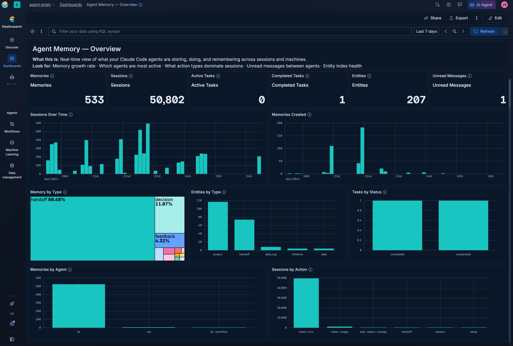

# agent-memory

Persistent memory and inter-agent communication for Claude Code, backed by Elasticsearch.

Claude Code agents are stateless between sessions. agent-memory gives them a shared, searchable store for decisions, context, session history, tasks, and project files — so agents pick up where they left off instead of rediscovering what they already knew.

## What you get

- **Semantic memory recall** — store decisions, patterns, and context; retrieve with hybrid keyword + semantic search instead of loading full files into context
- **Session history** — every agent action logged and queryable by agent, time range, or tag
- **Entity search** — markdown files auto-indexed on every write; semantic search across your project docs without directory scans
- **Inter-agent messaging** — typed messages between agents across machines, with thread support and priority
- **Task tracking** — full lifecycle from `created` through `completed` or `failed`, with notes and outcomes
- **Offline resilience** — writes queue locally when Elasticsearch is unreachable; `bridge sync` flushes them when connectivity returns

### Why this matters for context

Recalling a stored memory costs a single search query. The alternative is loading files into context or re-deriving conclusions. Entity search replaces shell globbing and grep with a semantic query that returns the relevant file, not a wall of results.

## Quick start

```bash
git clone https://github.com/jeffvestal/agent-memory && cd agent-memory
./install.sh
./bridge status
```

`install.sh` walks you through credentials, creates the Jina v5 semantic inference endpoint, and sets up seven Elasticsearch indices. `bridge status` confirms connectivity and shows doc counts. Add `bridge` to your `PATH` once setup completes.

## Hook integration

Copy `hooks/settings.json.template` into your project's `.claude/settings.json` and replace `REPLACE_WITH_AGENT_MEMORY_PATH` with the absolute path to your agent-memory clone:

```json
{
  "hooks": {
    "SessionStart": [
      {
        "matcher": "",
        "hooks": [
          {
            "type": "command",
            "command": "/path/to/agent-memory/bridge sync-memories && /path/to/agent-memory/bridge heartbeat"
          }
        ]
      }
    ],
    "PostToolUse": [
      {
        "matcher": "Write|Edit|MultiEdit|NotebookEdit",
        "hooks": [
          {
            "type": "command",
            "command": "/path/to/agent-memory/hooks/index-file.sh"
          }
        ]
      }
    ],
    "Stop": [
      {
        "matcher": "",
        "hooks": [
          {
            "type": "command",
            "command": "/path/to/agent-memory/bridge log --action session-end --quiet"
          }
        ]
      }
    ]
  }
}
```

| Hook | Trigger | What it does |
|---|---|---|
| `SessionStart` | Agent session opens | Syncs auto-memory files to ES; sends heartbeat |
| `PostToolUse` | Any Write / Edit / MultiEdit | Indexes changed `.md` files as searchable entities |
| `Stop` | Agent session ends | Logs a session-end event to history |

## Configuration reference

Copy `.env.example` to `.env` (or let `install.sh` create it).

| Variable | Required | Default | Purpose |
|---|---|---|---|
| `BRIDGE_ES_URL` | yes | — | Elasticsearch Serverless endpoint |
| `BRIDGE_ES_API_KEY` | yes | — | API key with index permissions on `agent-*` indices |
| `BRIDGE_AGENT_ID` | yes | — | Short agent name, e.g. `myagent` |
| `KIBANA_URL` | no | — | Kibana URL; enables Agent Builder and dashboard import |
| `BRIDGE_WATCH_DIRS` | no | `$PWD` | Space-separated directories to index as entities |
| `BRIDGE_MEMORY_PATH` | no | `~/.claude/projects/<cwd>/memory` | Path to Claude Code auto-memory directory |
| `BRIDGE_TIMEOUT` | no | `5` | Elasticsearch request timeout in seconds |
| `BRIDGE_ENTITY_INDEX` | no | `{agent}-entities` | Entity index name; set by `install.sh` |
| `BRIDGE_ENTITY_HISTORY_INDEX` | no | `{agent}-entity-history` | Entity history index name; set by `install.sh` |

## Architecture

```
┌──────────────────────────────────────────────────────────────┐
│                    Claude Code agent                          │
│   sessions, decisions, file writes, tasks, messages          │
└──────────────────────┬──────────────────────────────────────┘
                       │  PostToolUse hook  (every .md write)
                       │  SessionStart hook  (heartbeat + memory sync)
                       ▼
┌─────────────────────────────────────────────────────────────┐
│               bridge CLI  (lib/*.sh modules)                 │
│   memory · messages · tasks · sessions · entities           │
└──────────────────────┬──────────────────────────────────────┘
                       │  online: direct index
                       │  offline: fallback/ queue → bridge sync
                       ▼
┌────────────────────────────────────┐   ┌───────────────────────┐
│        Elasticsearch Serverless    │   │  fallback/{agent}/    │
│  agent-memory   agent-messages    │   │  outbox/  (JSON queue) │
│  agent-tasks    agent-sessions    │   │  synced on reconnect   │
│  agent-status   {agent}-entities  │   └───────────────────────┘
└────────────────────────────────────┘
```

**Hybrid search** — memory and entity recall use Reciprocal Rank Fusion combining Jina v5 semantic embeddings with BM25 on title, content, and tags. Pass `--semantic`, `--keyword`, or `--hybrid` (default) to control the mode.

**Offline queue** — when Elasticsearch is unreachable, every write lands in `fallback/{agent}/outbox/` as a JSON file. `bridge sync` uploads the queue via bulk API when connectivity returns.

**Auto-memory sync** — on `SessionStart`, `bridge sync-memories` reads `~/.claude/projects/<cwd>/memory/*.md`, hashes each file, and re-indexes only changed files into `agent-memory`.

**Entity indexing** — the `PostToolUse` hook calls `bridge entity index-file` on every markdown write. Entity IDs are `{agent}-{type}-{slug}`, so re-indexing is idempotent.

## Troubleshooting

**`bridge status` shows offline**
- Confirm `BRIDGE_ES_URL` and `BRIDGE_ES_API_KEY` in `.env`
- Test directly: `curl -s "$BRIDGE_ES_URL" -H "Authorization: ApiKey $BRIDGE_ES_API_KEY"`
- Check API key has index permissions on `agent-memory`, `agent-messages`, `agent-tasks`, `agent-sessions`, `agent-status`, and `{agent}-entities`

**`install.sh` fails on Jina inference endpoint**
- Jina v5 requires an Elastic Serverless project (not a self-managed cluster)
- If creation fails, setup continues — memory and session features still work; semantic ranking falls back to keyword

**Semantic search returns no results**
- Confirm the inference endpoint exists: `bridge status` reports it
- Re-run `./install.sh` — it's idempotent and will recreate missing endpoints

**Hooks not firing**
- Verify the path in `settings.json` is absolute and points to the correct location
- Confirm `hooks/index-file.sh` is executable: `chmod +x hooks/index-file.sh`
- Check Claude Code hook logs: `~/.claude/logs/`

**`jq: command not found`**
- Install jq: `brew install jq` (macOS) or `apt install jq` (Linux)

**`Required variable not set` error**
- One of `BRIDGE_ES_URL`, `BRIDGE_ES_API_KEY`, or `BRIDGE_AGENT_ID` is missing from `.env`
- Run `./install.sh` to recreate the file interactively

**Offline queue not draining**
- Run `bridge sync` manually
- Check `fallback/{agent}/outbox/` for queued files
- Verify ES connectivity first with `bridge status`

## Dashboard



## License

Apache 2.0
